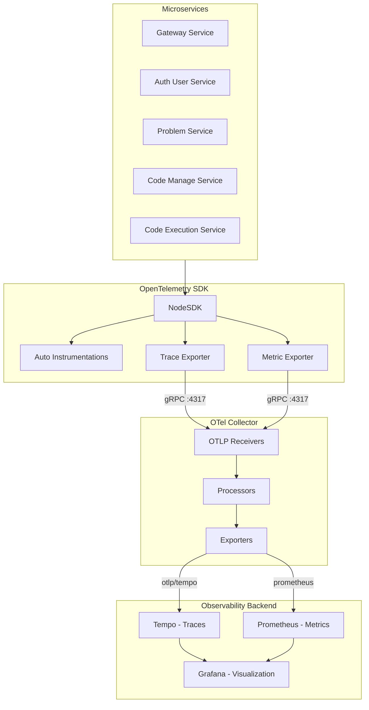
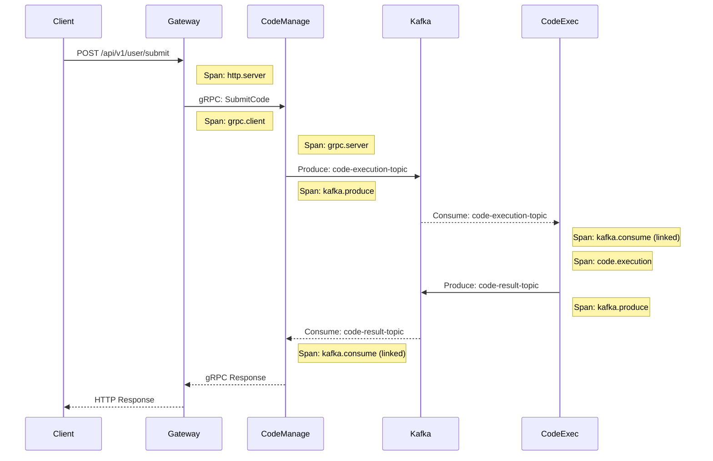

# Distributed Tracing in Codex Microservices

This document provides a comprehensive overview of how distributed tracing is implemented across the Codex microservice platform using **OpenTelemetry**.

---

## 1. Overview

Codex implements distributed tracing using the **OpenTelemetry (OTel)** standard, enabling end-to-end visibility across all microservices. The tracing infrastructure captures:

- **Traces**: Request flows across services
- **Metrics**: Performance measurements (latency, throughput)
- **Auto-instrumentation**: Automatic span creation for HTTP, gRPC, Kafka, and database operations

### Services with Tracing Enabled

| Service                | Tracing File            |
| ---------------------- | ----------------------- |
| gateway-service        | `src/config/tracing.ts` |
| auth-user-service      | `src/config/tracing.ts` |
| problem-service        | `src/config/tracing.ts` |
| code-manage-service    | `src/config/tracing.ts` |
| code-execution-service | `src/config/tracing.ts` |

> **Note**: `collab-service` does not currently have OpenTelemetry tracing configured.

---

## 2. Architecture



---

## 3. Tracing Configuration Details

### 3.1 OpenTelemetry SDK Setup

Each service initializes OpenTelemetry identically in `src/config/tracing.ts`:

```typescript
import { NodeSDK } from "@opentelemetry/sdk-node";
import { OTLPTraceExporter } from "@opentelemetry/exporter-trace-otlp-grpc";
import { OTLPMetricExporter } from "@opentelemetry/exporter-metrics-otlp-grpc";
import { getNodeAutoInstrumentations } from "@opentelemetry/auto-instrumentations-node";
import { PeriodicExportingMetricReader } from "@opentelemetry/sdk-metrics";
import { resourceFromAttributes } from "@opentelemetry/resources";
import { ATTR_SERVICE_NAME } from "@opentelemetry/semantic-conventions";
```

### 3.2 Core Components

| Component                         | Description                                  |
| --------------------------------- | -------------------------------------------- |
| **NodeSDK**                       | Main OpenTelemetry SDK for Node.js           |
| **OTLPTraceExporter**             | Exports traces via OTLP over gRPC            |
| **OTLPMetricExporter**            | Exports metrics via OTLP over gRPC           |
| **PeriodicExportingMetricReader** | Batches and exports metrics every 10 seconds |
| **Auto-Instrumentations**         | Automatic span creation for libraries        |

### 3.3 Environment Variables

| Variable                      | Description                           |
| ----------------------------- | ------------------------------------- |
| `OTEL_SERVICE_NAME`           | Service name for trace identification |
| `OTEL_EXPORTER_OTLP_ENDPOINT` | OTel Collector endpoint (gRPC)        |

**Example K8s Configuration:**

```yaml
- name: OTEL_SERVICE_NAME
  value: "gateway-service"
- name: OTEL_EXPORTER_OTLP_ENDPOINT
  value: "otel-collector-opentelemetry-collector.observability.svc.cluster.local:4317"
```

### 3.4 Initialization Pattern

Tracing is imported **at the very beginning** of each service's entry point (`src/index.ts`):

```typescript
import "./config/tracing"; // Must be first import!
import express from "express";
// ... rest of the application
```

> **Important**: The tracing import must be the first line to ensure all subsequent imports are automatically instrumented.

---

## 4. Auto-Instrumentation Per Service

Each service enables specific instrumentations based on its technology stack:

### Gateway Service

```typescript
instrumentations: getNodeAutoInstrumentations({
  "@opentelemetry/instrumentation-fs": { enabled: false },
  "@opentelemetry/instrumentation-grpc": { enabled: true },
  "@opentelemetry/instrumentation-ioredis": { enabled: true },
  "@opentelemetry/instrumentation-redis": { enabled: true },
  "@opentelemetry/instrumentation-pino": { enabled: true },
  "@opentelemetry/instrumentation-express": { enabled: true },
});
```

**Purpose**: Traces HTTP requests (Express), outbound gRPC calls, Redis caching, and structured logging.

---

### Auth User Service

```typescript
'@opentelemetry/instrumentation-grpc': { enabled: true },
'@opentelemetry/instrumentation-ioredis': { enabled: true },
'@opentelemetry/instrumentation-redis': { enabled: true },
'@opentelemetry/instrumentation-pino': { enabled: true },
'@opentelemetry/instrumentation-pg': { enabled: true }
```

**Purpose**: Traces gRPC server calls, PostgreSQL database queries, and Redis operations.

---

### Problem Service

```typescript
'@opentelemetry/instrumentation-grpc': { enabled: true },
'@opentelemetry/instrumentation-mongodb': { enabled: true },
'@opentelemetry/instrumentation-mongoose': { enabled: true },
'@opentelemetry/instrumentation-ioredis': { enabled: true },
'@opentelemetry/instrumentation-redis': { enabled: true },
'@opentelemetry/instrumentation-pino': { enabled: true }
```

**Purpose**: Traces MongoDB/Mongoose queries, gRPC calls, and Redis caching.

---

### Code Manage Service

```typescript
'@opentelemetry/instrumentation-grpc': { enabled: true },
'@opentelemetry/instrumentation-ioredis': { enabled: true },
'@opentelemetry/instrumentation-redis': { enabled: true },
'@opentelemetry/instrumentation-pino': { enabled: true },
'@opentelemetry/instrumentation-kafkajs': { enabled: true }
```

**Purpose**: Traces Kafka producer/consumer operations, gRPC calls, and Redis.

---

### Code Execution Service

```typescript
'@opentelemetry/instrumentation-grpc': { enabled: true },
'@opentelemetry/instrumentation-ioredis': { enabled: true },
'@opentelemetry/instrumentation-redis': { enabled: true },
'@opentelemetry/instrumentation-pino': { enabled: true },
'@opentelemetry/instrumentation-kafkajs': { enabled: true }
```

**Purpose**: Traces Kafka message processing, Redis operations, and code execution workflows.

---

## 5. Trace Context Propagation

OpenTelemetry automatically propagates trace context across:

### 5.1 gRPC Communication (Synchronous)

```
Gateway → Auth User Service
Gateway → Problem Service
Gateway → Code Manage Service
Gateway → Collab Service
Problem ↔ Auth User Service (cross-service calls)
Code Manage → Problem Service
```

The `@opentelemetry/instrumentation-grpc` automatically:

- Injects trace context into outgoing gRPC metadata
- Extracts trace context from incoming gRPC requests
- Creates child spans for each RPC call

### 5.2 Kafka Communication (Asynchronous)

```
Code Manage → Kafka → Code Execution
Code Execution → Kafka → Code Manage
```

The `@opentelemetry/instrumentation-kafkajs` automatically:

- Propagates trace context through Kafka message headers
- Links producer and consumer spans
- Maintains trace continuity across async boundaries

### 5.3 Redis Operations

All Redis operations (caching, pub/sub) are automatically traced with:

- Command type
- Key patterns
- Execution time

---

## 6. Observability Stack (Kubernetes)

### 6.1 OpenTelemetry Collector

**Configuration**: [`helm/observability-values/otel-collector-values.yaml`](file:///Users/akash/Desktop/codex-microservices/helm/observability-values/otel-collector-values.yaml)

```yaml
config:
  receivers:
    otlp:
      protocols:
        grpc:
          endpoint: 0.0.0.0:4317
        http:
          endpoint: 0.0.0.0:4318

  processors:
    batch:
      timeout: 10s
      send_batch_size: 1024
    memory_limiter:
      limit_percentage: 75
    probabilistic_sampler:
      sampling_percentage: 25

  exporters:
    otlp/tempo:
      endpoint: tempo.observability.svc.cluster.local:4317
    prometheus:
      endpoint: "0.0.0.0:9464"

  service:
    pipelines:
      traces:
        receivers: [otlp]
        processors: [memory_limiter, batch, probabilistic_sampler]
        exporters: [otlp/tempo, debug]
      metrics:
        receivers: [otlp]
        processors: [memory_limiter, batch]
        exporters: [prometheus, debug]
```

**Key Features:**

- **Probabilistic Sampling**: Only 25% of traces are stored (reduces storage costs)
- **Batch Processing**: Groups telemetry data before export
- **Memory Limiting**: Prevents OOM with backpressure

---

### 6.2 Tempo (Trace Storage)

**Configuration**: [`helm/observability-values/tempo-values.yaml`](file:///Users/akash/Desktop/codex-microservices/helm/observability-values/tempo-values.yaml)

```yaml
tempo:
  replicas: 2
  storage:
    trace:
      backend: local
  server:
    http_listen_port: 3200
```

Tempo stores traces and provides:

- Trace search by ID
- Service graph generation
- Span analysis

---

### 6.3 Grafana Integration

**Configuration**: [`helm/observability-values/grafana-values.yaml`](file:///Users/akash/Desktop/codex-microservices/helm/observability-values/grafana-values.yaml)

```yaml
datasources:
  - name: Tempo
    type: tempo
    url: http://tempo.observability.svc.cluster.local:3200
    jsonData:
      tracesToLogsV2:
        datasourceUid: loki
        filterByTraceID: true
      tracesToMetrics:
        datasourceUid: prometheus
      nodeGraph:
        enabled: true
```

**Features:**

- **Trace to Logs**: Correlate traces with Loki logs via trace_id
- **Trace to Metrics**: Link spans to Prometheus metrics
- **Service Map**: Visual representation of service dependencies
- **Node Graph**: Interactive trace visualization

---

## 7. Request Flow Example

Here's how a code submission request is traced:



All spans share the same **Trace ID**, enabling end-to-end visibility.

---

## 8. Graceful Shutdown

Each service handles graceful shutdown to ensure traces are flushed:

```typescript
const shutdown = async () => {
  logger.info("Shutting down OpenTelemetry SDK...");
  try {
    await sdk?.shutdown();
    logger.info("OpenTelemetry SDK terminated successfully");
  } catch (error) {
    logger.error("Error terminating OpenTelemetry SDK:", error);
  }
};

process.on("SIGTERM", shutdown);
process.on("SIGINT", shutdown);
```

---

## 9. Enabling Tracing in Kubernetes

Tracing is currently **commented out** in K8s and Helm configurations. To enable:

### 9.1 Kubernetes Manifests

Uncomment in each service YAML (e.g., `k8s/gateway-service.yaml`):

```yaml
- name: OTEL_EXPORTER_OTLP_ENDPOINT
  value: "otel-collector-opentelemetry-collector.observability.svc.cluster.local:4317"
```

### 9.2 Helm Values

Uncomment in each service's `values.yaml`:

```yaml
- name: OTEL_EXPORTER_OTLP_ENDPOINT
  value: "otel-collector-opentelemetry-collector.observability.svc.cluster.local:4317"
```

### 9.3 Deploy Observability Stack

Uncomment in [`helm/helmfile.yaml`](file:///Users/akash/Desktop/codex-microservices/helm/helmfile.yaml):

```yaml
- name: otel-collector
  namespace: observability
  chart: open-telemetry/opentelemetry-collector
  values:
    - observability-values/otel-collector-values.yaml

- name: tempo
  namespace: observability
  chart: grafana/tempo
  values:
    - observability-values/tempo-values.yaml
```

---

## 10. Tracing Summary Table

| Service                | Express | gRPC | Kafka | MongoDB | PostgreSQL | Redis | Pino Logs |
| ---------------------- | :-----: | :--: | :---: | :-----: | :--------: | :---: | :-------: |
| gateway-service        |   ✅    |  ✅  |  ❌   |   ❌    |     ❌     |  ✅   |    ✅     |
| auth-user-service      |   ❌    |  ✅  |  ❌   |   ❌    |     ✅     |  ✅   |    ✅     |
| problem-service        |   ❌    |  ✅  |  ❌   |   ✅    |     ❌     |  ✅   |    ✅     |
| code-manage-service    |   ❌    |  ✅  |  ✅   |   ❌    |     ❌     |  ✅   |    ✅     |
| code-execution-service |   ❌    |  ✅  |  ✅   |   ❌    |     ❌     |  ✅   |    ✅     |
| collab-service         |   ❌    |  ❌  |  ❌   |   ❌    |     ❌     |  ❌   |    ❌     |

---

## 11. Best Practices Implemented

1. **Early Initialization**: Tracing is always the first import
2. **Graceful Shutdown**: SDK properly flushes pending traces on termination
3. **Service Naming**: Each service has a unique `OTEL_SERVICE_NAME`
4. **Selective Instrumentation**: Only relevant instrumentations are enabled
5. **Disabled Noise**: File system instrumentation is explicitly disabled
6. **gRPC Protocol**: Uses efficient gRPC export over HTTP
7. **Timeout Configuration**: 5-second timeout on exporters prevents blocking
8. **Sampling**: 25% probabilistic sampling in production reduces storage

---

## 12. Troubleshooting

### Traces Not Appearing

1. Check `OTEL_EXPORTER_OTLP_ENDPOINT` is set
2. Verify OTel Collector is running
3. Check network connectivity to collector on port 4317
4. Review collector logs for export errors

### Missing Spans

1. Ensure tracing import is first in `index.ts`
2. Check specific instrumentation is enabled
3. Verify library versions match instrumentation versions

### High Latency

1. Reduce `exportIntervalMillis` for metrics
2. Adjust batch processor settings
3. Check collector resource limits

---

## 13. Related Resources

- [OpenTelemetry Documentation](https://opentelemetry.io/docs/)
- [Tempo Documentation](https://grafana.com/docs/tempo/)
- [Grafana Trace Visualization](https://grafana.com/docs/grafana/latest/explore/trace-integration/)
- [OpenTelemetry Collector Configuration](https://opentelemetry.io/docs/collector/configuration/)
